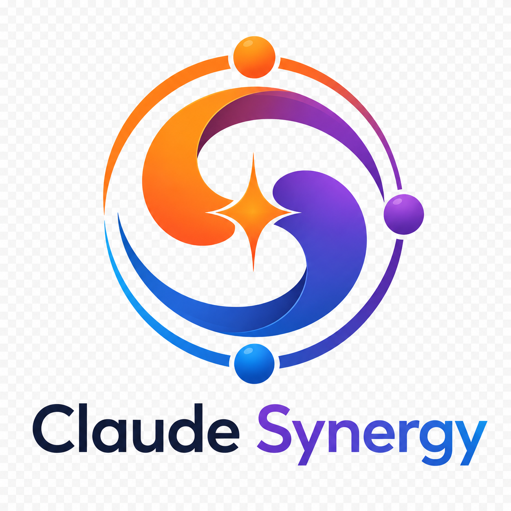

<p align="center"></p>

# Claude Synergy

A local, queryable mirror of every Anthropic + adjacent AI dev tool changelog — plus a curated **Synergy** layer describing cross-product workflows — so the LLM agent inside the harness knows what the harness can do.

<!-- Note: logo text may be dim on GitHub dark theme -->
[](https://github.com/mcp-tool-shop-org/claude-synergy/actions/workflows/test.yml) [](https://www.npmjs.com/package/@mcptoolshop/claude-synergy) [](#license)

```bash
$ hk query redact
2026-05-11  anthropic-cli@1.7.1            [changed]  redact api-key headers in debug logs
2026-05-11  anthropic-sdk-java@2.31.0      [changed]  redact api-key headers in debug logs
2026-05-11  anthropic-sdk-go@1.42.0        [changed]  redact api-key headers in debug logs
2026-05-07  anthropic-sdk-typescript@0.95.1 [changed] redact api-key headers in debug logs

4 results
```

**A single FTS query surfaces a coordinated cross-SDK security fix that no individual changelog flagged as a CVE.** That's the killer demo: patterns emerge when every changelog is side-by-side.

Repo: [github.com/mcp-tool-shop-org/claude-synergy](https://github.com/mcp-tool-shop-org/claude-synergy)

---

## The problem

Claude Code CLI ships ~daily. Claude API ships almost as often. SDKs ship per-CLI-release. Claude Design, Cowork, Chat, and Mobile feed through the unified Help Center. The MCP ecosystem ships ~200-300 new servers per week. Plus there are 7 major AI dev tool surfaces (Cursor, Aider, Continue, Copilot, Cody, Windsurf) all shipping their own changelogs at their own cadences.

The LLM agent inside any one of these has a frozen training cutoff. The gap widens every day. Features ship that the agent doesn't know exist. Bugs get fixed that the agent still works around. Env vars and flags get added that the agent never suggests. Cross-product workflows that compose multiple surfaces remain undiscovered.

**This repo closes the gap.** The Synergy section makes it a product instead of a mirror.

---

## What's here

```
claude-synergy/
├── products/                # 44 product directories (1,186 release files)
│   ├── claude-code/             # Anthropic CLI — 117 releases
│   ├── claude-agent-sdk-{python,typescript}/  # Agent SDKs
│   ├── anthropic-sdk-{python,typescript,go,java,csharp,ruby,php}/  # 7 language SDKs
│   ├── claude-api/              # Platform release notes
│   ├── anthropic-apps/          # Design / Cowork / Chat / Mobile (Help Center feed)
│   ├── claude-code-action/      # GitHub Action
│   ├── anthropic-cli/           # `ant` CLI
│   ├── mcp-{python,typescript,go,java,csharp,kotlin,ruby,swift,rust,php}-sdk/
│   ├── mcp-{spec,inspector,registry,mcpb,conformance}/
│   ├── cursor/                  # RSS feed
│   ├── aider/                   # raw HISTORY.md
│   ├── continue-{dev,cli}/      # GH releases
│   ├── cody-enterprise/         # filtered Sourcegraph RSS
│   ├── github-copilot/          # HTML scrape (github.blog)
│   ├── vscode-copilot-chat/     # HTML scrape (code.visualstudio.com)
│   ├── windsurf/                # Playwright fetcher (CSR-only changelog)
│   ├── skills/                  # Anthropic Skills catalog
│   └── plugins-{official,community,knowledge-work}/  # Plugin marketplaces
├── synergies/               # 12 curated cross-product workflows
├── src/                     # TypeScript implementation
├── test/                    # 342 tests (unit, integration, regression, smoke)
├── data/claude-synergy.db   # SQLite database (created by `hk init`)
├── schema.sql               # Tier 2a tables (products, releases, changes, entities, FTS5, …)
├── schema-vec.sql           # Tier 2b tables (chunks, chunks_vec, chunks_fts)
├── SOURCES.md               # 5-tier source landscape with fetch strategies
└── URGENT_FINDINGS.md       # 23 actionable items surfaced from the corpus
```

**Live numbers (as of v0.7.2):** 44 products / 1,186 release files / 6,042 changes / 1,225 entities / 12 synergies / 342 tests.

---

## Status — all tiers shipped

| Tier | Status | What's there |
|------|--------|--------------|
| **1 — bootstrap (markdown corpus)** | ✅ shipped | Study-swarm seeded 706 release files Jan→May 2026; extended to 1,186 by Tier 4d |
| **2a — SQLite + FTS5 + CLI** | ✅ shipped | `hk` CLI; 15 subcommands; sub-300ms ingest |
| **2b — sqlite-vec + Contextual Retrieval** | ✅ shipped | Provider-pluggable (none/structured/ollama/claude-haiku context × ollama/voyage embed × none/ollama-judge/voyage/cohere rerank) |
| **3 — sync + MCP server** | ✅ shipped | `hk fetch / sync / seed-markers`; `claude-synergy-mcp` exposes 8 tools over stdio |
| **4a — extend beyond Anthropic** | ✅ shipped | +15 MCP SDKs, Cursor (RSS), Aider (HISTORY.md), Continue.dev, Cody Enterprise (RSS filtered) |
| **4b — HTML-scrape fetcher** | ✅ shipped | GitHub Copilot + VS Code Chat (Windsurf needs Playwright — v0.7) |
| **4c — turndown HTML→markdown ingest** | ✅ shipped | HTML bodies (Copilot/VS Code/Cursor) now produce per-bullet rows for FTS5 + entity extraction |
| **4d — Playwright + MCP registry + YAML config** | ✅ shipped | Windsurf via Playwright; Smithery + official MCP Registry as Tier-4 catalogs; products consolidated into `products.yaml` |

Roadmap for v0.8+: tracked in [URGENT_FINDINGS.md](URGENT_FINDINGS.md) and issues.

---

## Install

```bash
git clone https://github.com/mcp-tool-shop-org/claude-synergy
cd claude-synergy
pnpm install
pnpm build       # produces dist/cli.js + dist/mcp-server.js
npm link         # makes `hk` and `claude-synergy-mcp` available globally
```

For dev without building, use `npx tsx src/cli.ts ...` directly. **pnpm 10 quirk:** `pnpm dev` swallows CLI flags after `--`; use `npx tsx` for development.

---

## CLI surface — 15 commands

```
# DB lifecycle
hk init                              # create DB with schema
hk ingest                            # parse products/*/releases/*.md → DB (idempotent)
hk embed                             # generate chunks + embeddings (sqlite-vec)
hk fetch [--product X]               # incremental pull from sources
hk sync                              # combined fetch → ingest → embed (cron-friendly)
hk seed-markers                      # one-time setup after initial corpus

# Search
hk query "managed agents"            # FTS5 keyword search
hk hybrid "credential exfiltration"  # FTS5 + vec hybrid via RRF (+ optional --rerank)

# Entity lookups
hk env-var CLAUDE_CODE_WORKFLOWS     # when introduced + history
hk command code-review               # slash command + rename history
hk model claude-opus-4-7             # model launch + mentions across products
hk cve CVE-2025-66414                # CVE references in corpus

# Browsing
hk latest [--product X] [--limit N]  # recent releases
hk products                          # list all 44 with counts
hk top env_var                       # most-mentioned by entity type
                                     # (env_var, slash_command, cli_option,
                                     #  model_id, beta_header, cve, ghsa,
                                     #  hook_event, setting_key)
```

---

## Example workflows

**Find when a Claude Code env var was introduced:**
```
$ hk env-var CLAUDE_CODE_WORKFLOWS
env var CLAUDE_CODE_WORKFLOWS — 1 mention:

2026-05-21  claude-code@2.1.147  [added]
  Added the `Workflow` tool for deterministic multi-agent orchestration.
  It is off by default — set `CLAUDE_CODE_WORKFLOWS=1` to enable
```

**Track a cross-SDK breaking change:**
```
$ hk query TodoWrite --limit 5
2026-05-15  claude-agent-sdk-python@0.2.82       [breaking]   Headless and SDK sessions now use Task tools...
2026-05-14  claude-agent-sdk-typescript@0.3.142  [breaking]   Headless and SDK sessions now use Task tools...
2026-05-08  claude-agent-sdk-typescript@0.2.136  [deprecated] Deprecated TodoWrite tool...
```

**Plan a model migration:**
```
$ hk model claude-opus-4-20250514
model id claude-opus-4-20250514 — 2 mentions:

2026-04-14  anthropic-sdk-python@0.94.0  [deprecated]
  Deprecation of the Claude Sonnet 4 model and the Claude Opus 4 model,
  with retirement on the Claude API scheduled for June 15, 2026...
```

**Semantic search across the whole corpus:**
```
$ hk hybrid "credential exfiltration" --limit 3
2026-03-25  claude-code@2.1.83  [added]          vec#5 rrf=0.0154
  Added `CLAUDE_CODE_SUBPROCESS_ENV_SCRUB=1` to strip Anthropic and
  cloud provider credentials from subprocess environments...
```

The query never says "env_scrub" — vec surfaces it by semantic similarity. Pure FTS5 misses it entirely.

---

## MCP server — give your agents access to this corpus

`claude-synergy-mcp` exposes 8 tools over stdio. Wire into Claude Code (or any MCP host) via `~/.claude/.mcp.json` or your project's `.mcp.json`:

```json
{
  "mcpServers": {
    "claude-synergy": {
      "command": "claude-synergy-mcp",
      "env": {
        "CLAUDE_SYNERGY_DB": "/path/to/claude-synergy/data/claude-synergy.db"
      }
    }
  }
}
```

For GitHub Copilot's `.vscode/mcp.json`, use the `servers` wrapper instead of `mcpServers` (see [synergy 12](synergies/12-mcp-config-format-gotcha.md)).

Tools exposed:

| Tool | Purpose |
|---|---|
| `search` | Hybrid FTS5 + vec; optional rerank. Default mode for natural-language queries. |
| `lookup_entity` | Exact entity history: env vars, slash commands, model IDs, CVEs, etc. |
| `latest_releases` | Recent releases across products (or one) |
| `get_release` | Full content of one release |
| `list_products` | Enumeration with counts + latest version |
| `top_entities` | Most-mentioned entities by type |
| `list_synergies` | Curated cross-product workflows |
| `read_synergy` | Full text of one synergy file |

---

## Sources — 5 tiers, 6 fetcher strategies

Full landscape in [SOURCES.md](SOURCES.md).

- **Tier 1 (GitHub Releases)** — `gh api repos/<owner>/<repo>/releases` for 22 products including Anthropic SDKs (7 languages), Agent SDKs (2), ant CLI, claude-code-action, claude-code-security-review, and 15 MCP ecosystem SDKs
- **Tier 2 (raw markdown)** — `anthropics/claude-code/CHANGELOG.md` + `Aider-AI/aider/HISTORY.md`
- **Tier 3 (HTML / RSS)** — `platform.claude.com/docs/release-notes`, `support.claude.com/articles/12138966`, `cursor.com/changelog/rss.xml`, `sourcegraph.com/changelog/featured.rss` (filtered), `github.blog/changelog/label/copilot/`, `code.visualstudio.com/updates/v1_NNN`
- **Tier 4 (catalog)** — `anthropics/skills`, `claude-plugins-{official,community}`, `knowledge-work-plugins`
- **Tier 5 (advisory)** — `@ClaudeCodeLog` X account; marckrenn changelog mirror

Fetch strategies: `gh-releases | rss | raw-changelog | html-scrape | catalog | playwright`. New product = one entry in `products.yaml`.

---

## Synergies — what gets unlocked

12 curated cross-product workflows. Each describes a composition pattern, the trigger that makes it the right answer, and the changelog evidence that enables it. Examples:

- **08 — Universal SKILL.md format** (Code + Cursor + Codex): one skill author, three agents read it
- **09 — MCP across seven surfaces** (Code + Cursor + Continue + Copilot + Windsurf + Cody + API): one binary, every agent
- **10 — Anthropic BYOK across surfaces**: one API key powers Claude in 7 editors with unified billing
- **11 — Claude Code orchestrates Aider**: cost-shift heavy edits to a cheap model while Claude plans
- **12 — MCP config format gotcha**: Copilot uses `servers`; everyone else uses `mcpServers`

Full index in [synergies/INDEX.md](synergies/INDEX.md).

---

## Testing

Vitest suite covers unit / integration / regression / smoke tiers. **[test-spec-3.md](test-spec-3.md) is the current authority** as of v0.7.0; [test-spec.md](test-spec.md) (v1) and [test-spec-2.md](test-spec-2.md) (v2) remain in the repo as historical record of the design lineage.

```bash
pnpm test               # unit + integration + regression (~13s, 342 tests)
pnpm test:watch         # interactive
pnpm test:coverage      # generate coverage/index.html (thresholds: 78/75/85/78)
pnpm test:smoke         # opt-in full-corpus smoke (RUN_SMOKE=1)
```

Layout:

| Dir | What it covers |
|-----|----------------|
| `test/unit/` | per-module — extract, ingest, query, db, embed, hybrid, fetch + every provider + fetch-rss/changelog/html + fetch-mcp-registry + fetch-playwright + products-config |
| `test/integration/` | end-to-end — pipeline, sync, MCP server (stdio JSON-RPC), CLI |
| `test/regression/` | §8.1–§8.18 — each protects against a real bug fixed during development |
| `test/smoke/` | opt-in full-corpus against real `products/` (1,143 files) |
| `test/fixtures/` | 3 fake products + mock HTTP responses (RSS / GH / Voyage / Cohere / Ollama / Anthropic / Smithery / Official MCP Registry) |
| `test/helpers/` | `temp-db.ts`, `fetch-mock.ts`, `mcp-client.ts`, `seed-corpus.ts`, `golden-vectors.ts`, `playwright-mock.ts`, `yaml-fixtures.ts` |

**No network in tests by default** — provider HTTP is mocked via `vi.spyOn(global, 'fetch')`. Real SQLite in temp files (not `:memory:`) because sqlite-vec extension load semantics differ across versions and on-disk is the canonical path. Playwright is loaded via dynamic import and mocked via `vi.doMock('playwright', ...)` so tests pass without a real browser install.

CI: `.github/workflows/test.yml` runs `pnpm test:coverage` on push and PR.

---

## Troubleshooting

**"Database locked" or WAL errors**

Another `hk` process (or a stale MCP server) is holding the SQLite database open. Close other `hk` processes, then retry. If the issue persists, check for a `-wal` or `-shm` file alongside `data/claude-synergy.db` — these are normal WAL-mode files and will be cleaned up when the last connection closes. Do not delete them while another process has the DB open.

**"sqlite-vec extension not found" / sqlite-vec load failed**

The `sqlite-vec` native extension failed to load. Common causes:

1. **Node version too old** — `claude-synergy` requires Node 22+. Check with `node -v`.
2. **Native module needs rebuild** — run `npm rebuild better-sqlite3` (or `pnpm rebuild better-sqlite3`).
3. **Platform mismatch** — on Windows/ARM, `better-sqlite3` needs a C++ build toolchain. Install the [windows-build-tools](https://github.com/nicedoc/windows-build-tools) or Visual Studio Build Tools with "Desktop development with C++".

Note: `sqlite-vec` is optional. FTS5 keyword search (`hk query`) works without it. Only `hk embed` and `hk hybrid` require the vector extension.

**"Sync failed for product X" / fetch errors**

`hk fetch` and `hk sync` call external APIs. Common causes:

- **GitHub rate limit** — the `gh-releases` strategy shells out to `gh api`, which uses your `GITHUB_TOKEN`. Unauthenticated requests hit 60 req/hr; authenticate with `gh auth login` or set `GITHUB_TOKEN` in your environment.
- **Network / proxy** — RSS and HTML fetchers use `fetch()`. Check connectivity and any corporate proxy settings (`HTTPS_PROXY`).
- **Unknown product** — `hk fetch --product foo` only works for products listed in `products.yaml`. Run `hk products` to see all available names.

Sync is idempotent — safe to re-run after a partial failure. Already-fetched releases are skipped.

**"Embedding provider not responding"**

`hk embed` calls an external embedding service:

- **Ollama (default)** — ensure Ollama is running (`ollama serve`) and the embedding model is pulled (`ollama pull nomic-embed-text`).
- **Voyage** — set `VOYAGE_API_KEY` in your environment. Check your API key at [dash.voyageai.com](https://dash.voyageai.com).

**Schema version mismatch / corrupted database**

If the DB was created with an older schema version and migration fails, or if data looks wrong after a crash:

```bash
rm data/claude-synergy.db data/claude-synergy.db-wal data/claude-synergy.db-shm
hk init
hk ingest
hk embed --context structured --embedding ollama   # optional, for vector search
```

This is safe — the DB is a derived cache. All source data lives in `products/*/releases/*.md` files.

---

## Related files

- [CONTRIBUTING.md](CONTRIBUTING.md) — how to add products, run tests, submit PRs
- [URGENT_FINDINGS.md](URGENT_FINDINGS.md) — 23 actionable items (security CVEs, model retirements, breaking changes, config gotchas)
- [SOURCES.md](SOURCES.md) — 5-tier source landscape with fetch strategies
- [synergies/INDEX.md](synergies/INDEX.md) — 12 curated cross-product workflows
- [schema.sql](schema.sql) + [schema-vec.sql](schema-vec.sql) — SQLite + sqlite-vec schemas
- [test-spec-3.md](test-spec-3.md) (current) + [test-spec-2.md](test-spec-2.md), [test-spec.md](test-spec.md) (historical) — test suite specs

---

## License

MIT. Author: [mcp-tool-shop](https://github.com/mcp-tool-shop-org).
